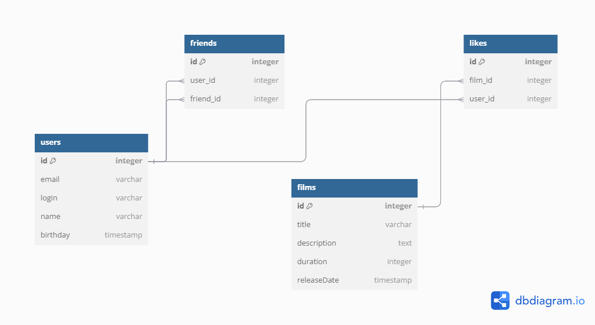
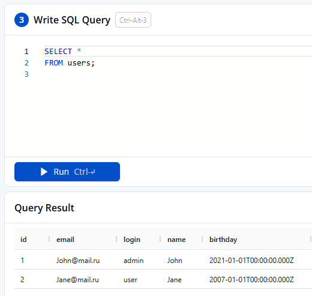
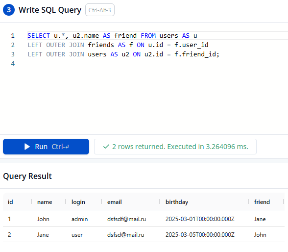
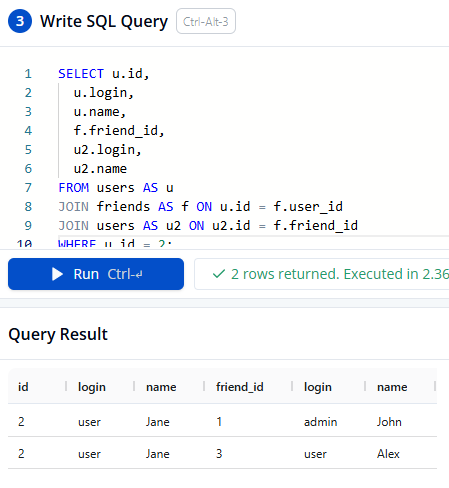
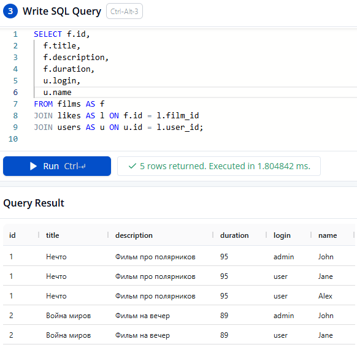

# java-filmorate

# ER-диаграмма:



# Код для схемы базы данных:

```sql

Table users {
  id integer [primary key]
  email varchar
  login varchar
  name varchar
  birthday timestamp
}

Table friends {
  id integer [primary key]
  user_id integer
  friend_id integer
}

Table films {
  id integer [primary key]
  title varchar
  description text [note: 'Description of film']
  duration integer
  releasedate timestamp
}

Table likes {
  id integer [primary key]
  film_id integer
  user_id integer
}

Ref: friends.user_id > users.id
Ref: friends.friend_id > users.id
Ref: likes.film_id > films.id 
Ref: likes.user_id > users.id 

```

# Пример запросов к базе данных:

1. Получение всех строк из таблицы users:

- 

2. Получение всех пользователей и их друзей:

- 

3. Получение друзей одного пользователя:

- 

4. Получение фильмов с лайками от пользователей:

- 
