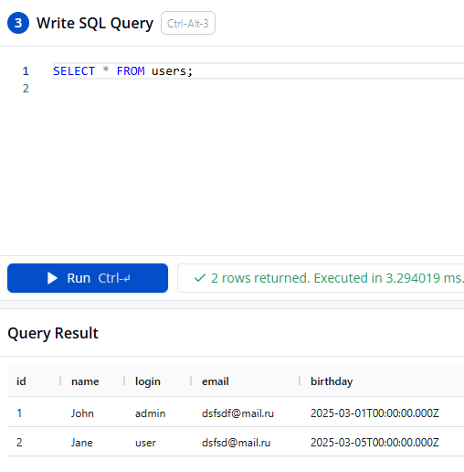

# java-filmorate

# Пример запросов к базе данных:

1. Получение всех строк из таблицы users:

- 

2. Получение всех пользователей и их друзей:

- 

3. Получение друзей одного пользователя:

- 

4. Получение фильмов с лайками от пользователей:

- 
