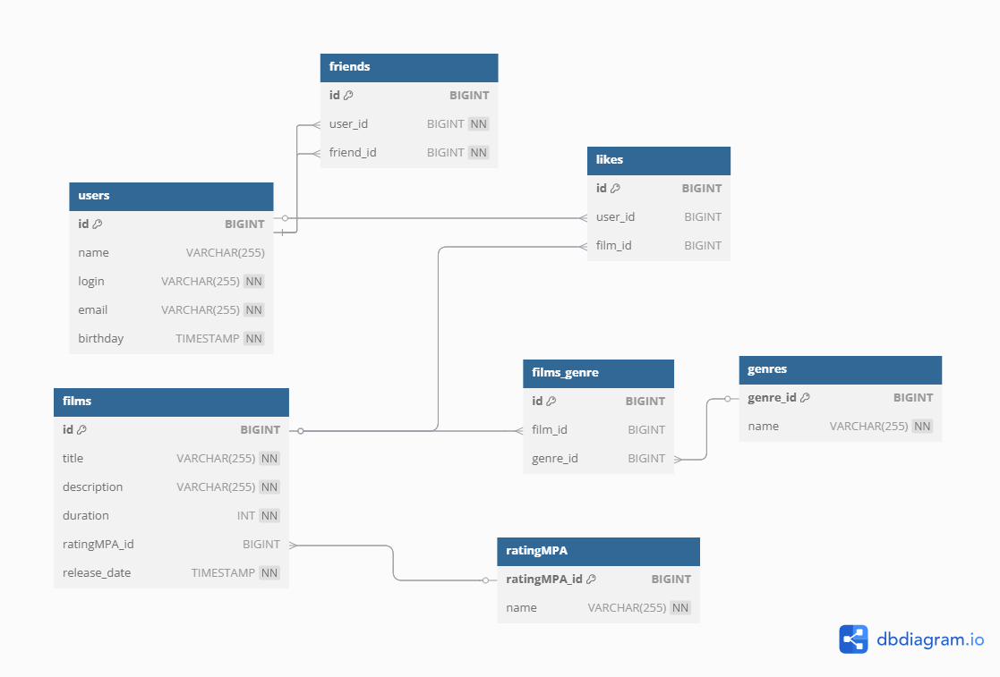

# java-filmorate

# ER-диаграмма:



# Код для схемы базы данных:

```sql

Table genres {
    genre_id BIGINT [pk, increment]
    name VARCHAR(255) [not null]
}

Table ratingMPA {
    ratingMPA_id BIGINT [pk, increment]
    name VARCHAR(255) [not null]
}

Table users {
    id BIGINT [pk, increment]
    name VARCHAR(255)
    login VARCHAR(255) [not null]
    email VARCHAR(255) [unique, not null]
    birthday TIMESTAMP [not null]
}

Table friends {
    id BIGINT [pk, increment]
    user_id BIGINT [not null, ref: > users.id]
    friend_id BIGINT [not null, ref: > users.id]
}

Table films {
    id BIGINT [pk, increment]
    title VARCHAR(255) [not null]
    description VARCHAR(255) [not null]
    duration INT [not null]
    ratingMPA_id BIGINT [ref: > ratingMPA.ratingMPA_id]
    release_date TIMESTAMP [not null]
}

Table likes {
    id BIGINT [pk, increment]
    user_id BIGINT [ref: > users.id]
    film_id BIGINT [ref: > films.id]
}

Table films_genre {
    id BIGINT [pk, increment]
    film_id BIGINT [ref: > films.id]
    genre_id BIGINT [ref: > genres.genre_id]
} 

```

# Пример запросов к базе данных:

1. Получение всех строк из таблицы users:

- 

2. Получение всех пользователей и их друзей:

- 
